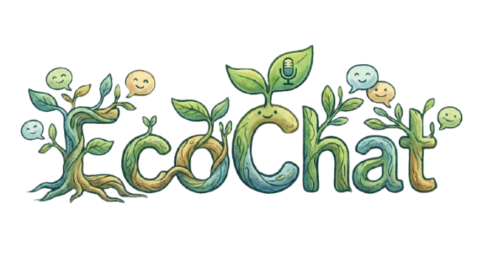

<div align="center">
  
  <h1>EcoChat: Chat with CSV Data</h1>
  
  <p>
    <b>A RAG-based pipeline to query Google Drive CSVs using Natural Language.</b>
  </p>

  <a href="https://www.python.org/">
    
  </a>
  <a href="https://streamlit.io/">
    
  </a>
  <a href="https://www.langchain.com/">
    
  </a>
  <a href="https://ai.google.dev/">
    
  </a>
</div>

<br>


## Overview

**EcoChat** is an interactive **Retrieval-Augmented Generation (RAG)** application that allows users to "chat" with their raw CSV data. Instead of writing complex SQL queries or Pandas code, you can simply ask questions like *"Who is the Manager?"* or *"What is the total salary budget?"*.

The system fetches data directly from **Google Drive**, processes it using **HuggingFace embeddings**, stores it in a **Pinecone vector database**, and generates answers using **Google's Gemini Flash** model.

<b>Why the name EcoChat?</b> <br>
The name EcoChat stands for 'Economical', emphasizing that the entire pipeline is engineered using 100% free and open-source tools (Gemini Free Tier, Pinecone, and Sentence Transformers), making it a completely zero-cost and sustainable solution.

<br>

## Key Features

* **Cloud Integration:** Fetches CSV files directly from Google Drive via Service Account.
* **Free Embeddings:** Utilizes local HuggingFace models (`all-mpnet-base-v2`) for zero-cost vectorization.
* **Vector Search:** Implements Pinecone (Serverless) for fast, semantic information retrieval.
* **Smart AI:** Powered by Google's gemini-flash-latest for accurate context generation.
* **Interface:** Includes a beautiful **Streamlit Web UI**.

<br>


## Tech Stack

| Component | Technology | Description |
| :--- | :--- | :--- |
| **Language** | Python | Core logic and scripting |
| **Orchestration** | LangChain | Connecting LLMs, Retrievers, and Data |
| **LLM** | Google Gemini | Generative AI model (Free Tier) |
| **Vector DB** | Pinecone | Storing and searching data embeddings |
| **Frontend** | Streamlit | Interactive Web User Interface |
| **Embeddings** | HuggingFace | `sentence-transformers/all-mpnet-base-v2` |

<br>

## Prerequisites

Before running the project, ensure you have the following keys:

1.  **Google Service Account:**
    * Enable **Google Drive API**.
    * Download the JSON key file.
    * **Important:** Share your CSV file on Google Drive with the `client_email` address inside your JSON file.
2.  **Pinecone API Key:**
    * Create an index named `csv-chat`.
    * Dimensions: `768`.
    * Metric: `cosine`.
3.  **Google AI Studio Key:**
    * Get a free API key for Gemini.

<br>

## Installation & Setup

### 1. Clone the Repository
```bash
git clone https://github.com/Darahas1/EcoChat.git
```

### 2. Install Dependencies
```bash
pip install -r requirements.txt
```

### 3. Configure Environment Variables
```
# .env file content (below)

PINECONE_API_KEY=pa-xxxx-xxxx-xxxx
GOOGLE_API_KEY=AIzaSyxxxxxxxxx
GOOGLE_SERVICE_ACCOUNT_FILE=service_account.json
```

<br>

### Usage
```
streamlit run app.py
```

### sample output


<br>

### 🔧 Troubleshooting
<details> <summary><b>Error: 404 NOT_FOUND (Gemini)</b></summary>


This usually means the model name is incorrect for your API key. Update the code to use <code>gemini-flash-latest</code> or <code>gemini-pro</code>. </details>

<details> <summary><b>Error: 429 RESOURCE_EXHAUSTED</b></summary>


You have exceeded the free quota or are using a restricted model (like 2.0 Flash) without billing. Switch to <code>gemini-1.5-flash</code>. </details>

<details> <summary><b>Permission Denied (Google Drive)</b></summary>


You must explicitly share the CSV file on Google Drive with the email address found inside your <code>service_account.json</code> file. </details>
<br>

### 📜 License
This project is licensed under the MIT License - see the [LICENSE](https://github.com/Darahas1/EcoChat/blob/main/LICENSE) file for details.
<br>

<div align="center"> <sub>Built with 💚 by Sai Darahas</sub> </div>